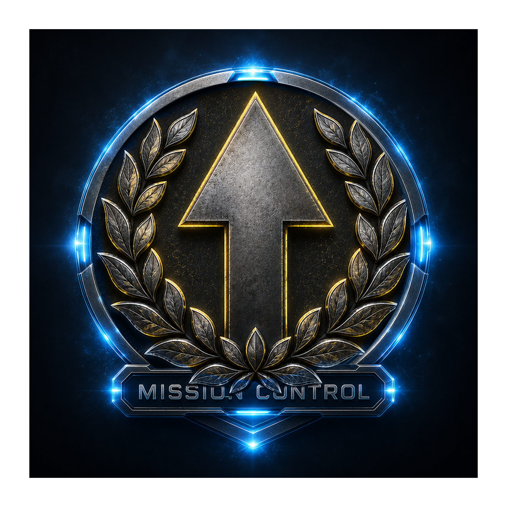

<div align="center">
  
</div>

# Mission Control

A personal command-center dashboard for orchestrating AI agents, projects, hardware builds, spend, and day-to-day ops — all from a single pane of glass.

Built with **React 18 + TypeScript + Tailwind CSS** on the frontend and an **Express 5** API server on the backend.

Press **⌘K** (Ctrl+K) anywhere for the command palette — jump to any page or search notes, docs, and tasks. Every view runs on real data from your connected agents; views lazy-load on demand.

---

## What's Inside

The sidebar is grouped into four sections — **Work**, **Knowledge**, **Build**, and **AI Ops** — plus Settings. Related monitoring views are consolidated into tabbed hubs rather than scattered across many sidebar entries.

### Work

| View | What you can do |
|------|----------------|
| **Home** | Landing overview — mission-control hero, an "at a glance" priority queue (alerts, overdue to-dos, pending approvals, system errors), and quick-view cards for usage, to-dos, projects, alerts, and system health. Every card deep-links to the right hub and tab. |
| **To-Do** | Personal quick-capture task list. Natural-language quick add (`!crit @long tomorrow`), severity levels (low → critical), short/long horizon, due dates with overdue badges, inline editing, and a one-click OpenClaw/Hermes research button that auto-attaches a summary, action steps, links, and key facts to each task. Optional **Additional Details** sub-panel (date, time, location, phone, cost, URL, contact, category, custom fields) with smart auto-detection from free text; all structured context is fed to the research agent as ground truth. Dated tasks can opt-in to **Google Calendar sync**. |
| **To-Buy** | Personal shopping list with the same click-to-open drawer as To-Do. Quick add with priority/quantity/price tokens (`power drill !high x1 $89`), a running estimated total, and one-click OpenClaw/Hermes research that returns general info, a fair price + range, online buy links, local store options, and key specs — auto-filling the item's price estimate. |
| **Spend** | Personal money command center. Separates **Claude Code** (a subscription — shown as token-equivalent *value*, not billed per-token) from **OpenClaw/Hermes agents** (real per-token API spend), plus a "things" lane (open To-Buy total + the value of hardware you already own). Pure aggregation over existing endpoints; 30-day trend and projected monthly. |
| **Tasks** | Create, triage, and filter work items, with an **Approvals** tab (review agent output — approve / reject / request changes) and an **Inbox** tab — a unified feed aggregating approvals, tasks, and to-dos with snooze, convert-to-task/note, and priority sorting. |
| **Chats** | Browse Claude / OpenClaw / Hermes conversation sessions. See token counts, cost per session, and open the full message history for any conversation. |
| **Calendar** | Day / Week / Month / Agenda views of your scheduled tasks and Google Calendar events, with prev / today / next navigation and an in-app event composer (create / edit / delete). |

### Knowledge

| View | What you can do |
|------|----------------|
| **Docs** | Documentation browser connected to your agent knowledge base, with a **Notes** tab (quick-capture scratchpad) and a **Links** tab — save, tag, pin, and archive bookmarks; add manually or via the Inbox "save as link" action. |
| **News** | Real-time curated news dashboard with three tabs: **Feed** (17 RSS/Atom sources across AI, computing, code, and robotics), **GitHub** (trending repos by time range and language), and **Buzz** (top discussions from HN, Reddit, and Lobsters). ADHD-friendly magazine-style hero, cross-source "Top right now" strip, category/platform filters, and 5-minute auto-refresh. |
| **Memory** | Inspect and manage agent memory stores. Read, search, and update memory entries across all connected agents. |

### Build

The hardware → ideas → projects loop in one place.

| View | What you can do |
|------|----------------|
| **Projects** | Kanban-style boards for tracking initiatives (drag cards across columns, set owners, attach notes), with a **Pipeline** tab — a multi-stage run monitor (card grid or Gantt timeline) with step-level traces and a cron jobs panel. |
| **Inventory** | Hardware catalog with SQLite-backed persistence. Search and filter items, view status (available / in-use / reserved), trigger per-item agent research, and inline-edit any field. |
| **Ideas** | Idea Factory — browse and triage the buildable project ideas the agents generate *from your inventory* (confidence/coolness scores, difficulty, cost/time, parts lists). Like / snooze / reject, filter by status, and trigger a new generation run. |

### AI Ops

Five consolidated hubs covering everything your agents do — built on local Claude Code logs plus the OpenClaw (WS) and Hermes (REST) gateways.

| View | What you can do |
|------|----------------|
| **Activity** | Live cross-platform agent monitoring in one place: **Live** (real-time tool calls / file reads / commands streamed from OpenClaw + Hermes), **Sessions** (run history with token/message totals and full transcripts), **Brain** (raw event log with tool-loop detection and top tools), **Agents** (who's running and their current state), and **Map** (node-link traffic topology, 1 h / 24 h / 7 d / all). |
| **Usage** | Cost & model analytics: a Claude Code token/cost view (daily trends, token mix, cost anomalies, per-model share, hour-of-day heatmap) plus a **Models** tab (Helicone-style spend, latency, volume, and failure rate per model with a cost-vs-latency scatter). |
| **Benchmarks** | Benchmark how a model performs *through* OpenClaw/Hermes (App → harness → model → tools/context/routing → result), not raw model APIs. 9 behaviour lanes, 4 task packs, deterministic scoring with normalized failure types, multi-sample **reliability** scoring, a per-task detail drawer, and a model/provider **Compare** fingerprint (reliability, speed ± stdev, verbosity/tokens, est. cost, fences). Runs real dispatches via the Hermes API server, OpenClaw WS, or any OpenAI-compatible `/v1` endpoint (LM Studio / Ollama / vLLM). |
| **Evals** | Agent performance evaluation hub. Model scorecard leaderboard, agent-model matrix, session trend chart, benchmark task runner (dispatched to the Hermes API server), memory benchmark panel (recall / multihop / temporal / conflict / applied / negative), and a scoring methodology reference. |
| **Health** | Platform & connector health: **System** (Claude config / MCP / plugin health, uptime, memory file browser), **Security** (connector token health, reachability, auth-error counts, risk badge, live diagnostics probes), **Alerts** (rule builder — error rate / loop / stalled / token spike / no activity — plus fired alerts), and per-platform deep-dive dashboards for **OpenClaw** and **Hermes**. |

### Settings

Configure connectors, API keys, the **Google** connection (connect / reconnect / disconnect), and application preferences.

---

## Tech Stack

- **Frontend** — React 18, TypeScript, Tailwind CSS, Vite, Lucide icons
- **Backend** — Express 5, tsx (TypeScript execution), dotenv, Node.js ≥ 18
- **Database** — SQLite via Node's built-in `node:sqlite` (`DatabaseSync`) for inventory, agent-event, and benchmark stores; JSON files for lighter stores (notes, alerts, connectors)
- **Integrations** — Google Calendar API (OAuth 2), Anthropic API, OpenClaw WebSocket, Hermes REST

---

## Getting Started

### Prerequisites

- **Node.js** ≥ 18
- **npm** ≥ 9

### Install

```bash
npm install
```

### Configure

Copy the example env file and fill in your credentials:

```bash
cp .env.example .env
```

Required variables (see `.env.example` for details):

| Variable | Purpose |
|----------|---------|
| `API_PORT` | Express server port (default `3001`) |
| `GOOGLE_CLIENT_ID` | Google OAuth client ID (Calendar) |
| `GOOGLE_CLIENT_SECRET` | Google OAuth client secret |
| `ANTHROPIC_API_KEY` | Anthropic API key (Radar analytics) |
| `GITHUB_TOKEN` | GitHub personal access token — optional; raises the Search API rate limit for the News → GitHub tab |

**Google Calendar:** set the two `GOOGLE_*` values, then connect from **Settings → Google** (or visit `/api/auth/google`). The refresh token is stored in `data/google-tokens.json` and refreshed automatically — no copy-paste. Publish your OAuth consent screen ("In production") in Google Cloud Console; while it is in "Testing" mode Google expires the refresh token after 7 days.

### Run

Start both the API server and Vite dev server:

```bash
npm run dev
```

- **Frontend** → `http://localhost:5173`
- **API** → `http://localhost:3001`

### Build

```bash
npm run build
```

---

## License

Private — not licensed for redistribution.

